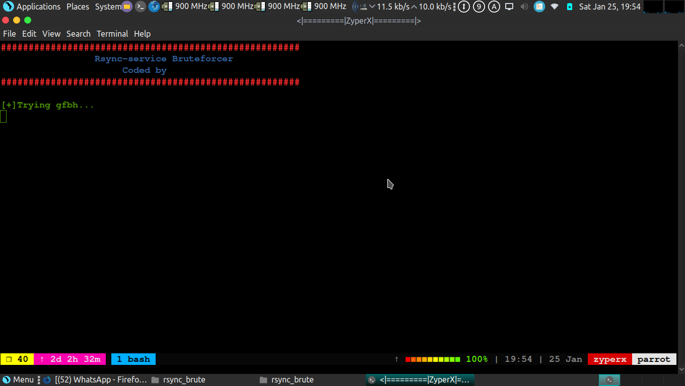
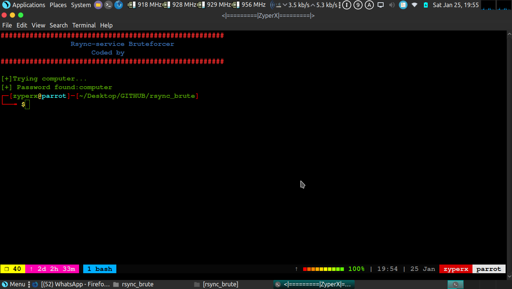
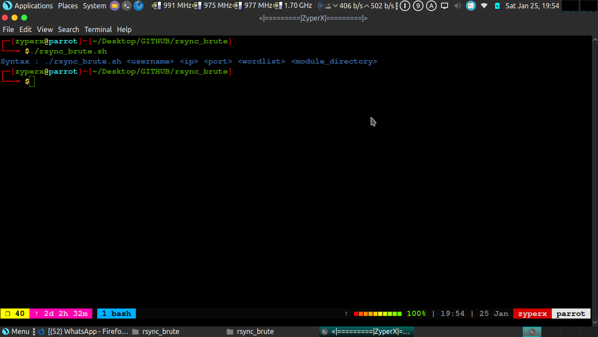

# <H1>RSYNC_BRUTE<H1>
<H1><U>RSYNC SERVICE BRUTEFORCER</U></H1>

[+]Fast rsync service bruteforcer

[+]Bruteforcing Rsync Service

[+]Found valid password

<h2>REQUIREMENTS</H2>
<H4>->RSYNC</H4>
<H4> sudo apt-get install rsync </H4>

<H2>INSTALLATION</H2>
<H4>->chmod a+x rsync_brute.sh</h4>

<H2>SYNTAX</H2>
<H4>->./rsync_brute.sh username host-ip port wordlist module_directory <H4>

